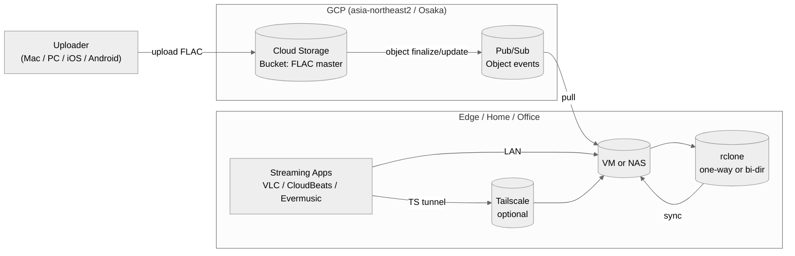

# Architecture — FLAC Cloud Stream

This document explains the overall system design for **flac-cloud-stream**.  
Goal: keep FLAC as the single source of truth in GCS and stream it securely from mobile/desktop with minimal ops.

---

## High-level Diagram



---

## Components

1. Cloud Storage (GCS)

   - Acts as the master library for FLAC files.
   - Bucket is region-bound to asia-northeast2 (Osaka) to keep latency/cost predictable in Japan.

2. Pub/Sub

   - Receives notifications when an object is created/updated in the bucket.
   - VM subscribes and triggers lightweight sync tasks.

3. VM or NAS (Edge)

   - Runs the pull_pubsub listener and rclone sync jobs.
   - Exposes files to players (SMB/NFS/HTTP/UPnP — choose per environment).

4. Tailscale (optional)

   - Zero-config mesh VPN for secure remote access to the VM/NAS.

5. Streaming Apps

   - VLC, CloudBeats, Evermusic, etc.
   - Connect via LAN or Tailscale IP/hostname.

---

## Event Flow

1. Upload: A FLAC file is uploaded to GCS.
2. Notify: GCS → Pub/Sub publishes an object event.
3. Consume: VM listener consumes the message.
4. Sync: rclone mirrors the relevant path(s) from GCS → VM/NAS.
5. Play: Clients stream from the VM/NAS (LAN or via Tailscale).

---

## Directory Conventions

- GCS prefix (example): flac-master/
- Artist/Album layout recommended:

    ```text
    flac-master/
      Artist/
        Album (Year)/
        01 - Track.flac
        ...
    ```

Keep names ASCII-friendly if you use cross-platform players to reduce metadata edge cases.

---

## Deployment Modes

- Minimal (LAN only): GCS + Pub/Sub + single VM on home network.
- Remote-first: Same as minimal, plus Tailscale for seamless out-of-home playback.
- Hybrid: Multiple edge nodes subscribing to the same bucket (e.g., home + office).

---

## Sync Policy

- Default: one-way GCS → VM/NAS (GCS is the source of truth).
- Optional: bi-directional with care (risk: conflict/duplication).
If you enable bi-dir: enforce checksum-based comparisons and explicit “protected” paths.

---

## Ops & Monitoring

- Use systemd to keep the listener alive on the VM.
- Surface logs to Cloud Logging (optional).
- Add a dry-run cron (e.g., nightly) to detect drift:
  rclone check gcs:BUCKET/PREFIX local:/path/PREFIX --one-way

---

## Security Notes

- Use a dedicated service account for Pub/Sub & GCS access (least privilege).
- Store credentials via Secret Manager or OS keychain; avoid committing secrets.
- Keep the bucket private; do not expose GCS publicly.

See [SECURITY.md](../SECURITY.md) for detailed IAM scopes.

---

### `.env.example`

```dotenv
# ===== Core GCP settings =====
GCP_PROJECT_ID=your-project-id
GCP_REGION=asia-northeast2

# GCS (master bucket)
GCS_BUCKET_NAME=your-flac-bucket
GCS_PREFIX=flac-master/

# Pub/Sub
PUBSUB_TOPIC=object-events
PUBSUB_SUBSCRIPTION=object-events-sub

# VM local paths
LOCAL_LIBRARY_ROOT=/srv/music
LOCAL_PREFIX=flac-master/

# rclone remotes (configure via `rclone config`)
RCLONE_REMOTE_GCS=gcs
RCLONE_REMOTE_LOCAL=local

# Sync behavior
SYNC_MODE=one-way        # one-way | bi-dir
RCLONE_FLAGS=--checksum --transfers=2 --checkers=4 --fast-list
```

---
